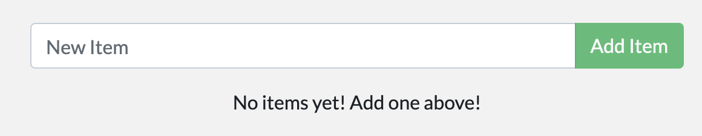

<div align="center">
    <a href="https://www.docker.com/">
        
    </a>
</div>

## Install

[Docker Desktop](https://docs.docker.com/desktop/) / [Docker Engine](https://docs.docker.com/engine/)

```shell
# Upgrade
sudo apt-get install ./docker-desktop-<version>-<arch>.deb
```

## Docker Hub

Docker Hub is the world's easiest way to create, manage, and deliver your team's container applications.

Browse over 100,000 container images from software vendors, open-source projects, and the community.

[Build and Ship any Application Anywhere](https://hub.docker.com/)

## Images

To download the latest [Node.js](https://hub.docker.com/_/node) image, we type the following command:

```shell
docker pull node
```

Download a specific version of Node.js, in this case version 18:

```shell
docker pull node:18
```

Sometimes Docker will throw us an error when downloading an image if we are on macOS or Windows, so, to fix it, we have to specify the download platform. In this case we will download the latest version of [MySQL](https://hub.docker.com/_/mysql):

```shell
docker pull --platform linux/x86_64 mysql
```

List all images downloaded to our computer:

```shell
docker images
```

Delete a specific image:

```shell
docker image rm node:18
```

## Containers

Before creating a container, we need to have an [image installed](#images). In this case we will download the latest version of [MongoDB](https://hub.docker.com/_/mongo):

```shell
docker pull mongo
```

Now that we have our MongoDB image downloaded, we can create our first container:

```shell
docker container create mongo
```

Run the container:

```shell
docker start container_ID
```

View the data and confirm the execution of the containers:

```shell
docker ps
```

Stop de container:

```shell
docker stop container_ID
```

Shows all existing containers regardless of whether they are running or not:

```shell
docker ps -a
```

Delete a specific container:

```shell
docker rm container_ID/Name
```

Create a container with a custom name:

```shell
docker create --name custom_Name mongo
```

Run the container with a custom name:

```shell
docker start custom_Name
```

We can also stop and remove the container with the custom name:

```shell
docker stop custom_Name
docker rm custom_Name
```

Create a container with the ports mapped:

```shell
docker create -p27017:27017 --name custom_Name mongo
```

Verify if your server ran correctly:

```shell
docker logs container_ID/Name
```

Verify if your server ran correctly with the option to keep listening:

```shell
docker logs --follow container_ID/Name
# Press 'Ctrl + C' to exit
```

We can download an image, create a container, and start it with a single command:

```shell
docker run mongo
```

We could also add an option so that it does not show us the logs:

```shell
docker run -d mongo
```

Finally we could mix all the commands and options for our MongoDB container:

```shell
docker run --name custom_Name -p27017:27017 -d mongo
```

## Get Started

The following guide has been taken from: https://docs.docker.com/get-started/

For the rest of this guide, you'll be working with a simple todo list manager that runs on Node.js. If you're not familiar with Node.js, don't worry. This guide doesn't require any prior experience with JavaScript.

### Prerequisites

- You have installed the latest version of [Docker Desktop](#install).
- You have installed a [Git client](./../Git/README.md).
- You have an IDE or a text editor to edit files. Docker recommends using [Visual Studio Code](https://code.visualstudio.com/).

### Get the app

Before you can run the application, you need to get the application source code onto your machine.

Clone the [getting-started-app](https://github.com/docker/getting-started-app/tree/main) repository using the following command:

```shell
git clone https://github.com/docker/getting-started-app.git
```

### Build the app's image

To build the image, you'll need to use a Dockerfile. A Dockerfile is simply a text-based file with no file extension that contains a script of instructions. Docker uses this script to build a container image.

Create an empty file named `Dockerfile`:

```shell
touch Dockerfile
```

Using a text editor or code editor, add the following contents to the Dockerfile:

```Dockerfile
# syntax=docker/dockerfile:1

FROM node:18-alpine
WORKDIR /app
COPY . .
RUN yarn install --production
CMD ["node", "src/index.js"]
EXPOSE 3000
```

In the terminal, make sure you're in the `getting-started-app` directory. Replace `/path/to/getting-started-app` with the path to your `getting-started-app` directory.

```shell
cd /path/to/getting-started-app
```

Build the image using the following command:

```shell
docker build -t getting-started .
```

The `docker build` command uses the Dockerfile to build a new image. You might have noticed that Docker downloaded a lot of "layers". This is because you instructed the builder that you wanted to start from the `node:18-alpine` image. But, since you didn't have that on your machine, Docker needed to download the image.

After Docker downloaded the image, the instructions from the Dockerfile copied in your application and used `yarn` to install your application's dependencies. The `CMD` directive specifies the default command to run when starting a container from this image.

Finally, the `-t` flag tags your image. Think of this as a human-readable name for the final image. Since you named the image `getting-started`, you can refer to that image when you run a container.

The `.` at the end of the `docker build` command tells Docker that it should look for the `Dockerfile` in the current directory.

### Start an app container

Now that you have an image, you can run the application in a container using the `docker run` command.

Run your container using the `docker run` command and specify the name of the image you just created:

```shell
docker run -dp 127.0.0.1:3000:3000 getting-started
```

The `-d` flag (short for `--detach`) runs the container in the background. The `-p` flag (short for `--publish`) creates a port mapping between the host and the container. The `-p` flag takes a string value in the format of `HOST:CONTAINER`, where `HOST` is the address on the host, and `CONTAINER` is the port on the container. The command publishes the container's port 3000 to `127.0.0.1:3000` (`localhost:3000`) on the host. Without the port mapping, you wouldn't be able to access the application from the host.

After a few seconds, open your web browser to [http://localhost:3000](http://localhost:3000/). You should see your app.



Add an item or two and see that it works as you expect. You can mark items as complete and remove them. Your frontend is successfully storing items in the backend.

At this point, you have a running todo list manager with a few items.

If you take a quick look at your containers, you should see at least one container running that's using the `getting-started` image and on port `3000`. To see your containers, you can use the CLI or Docker Desktop's graphical interface.