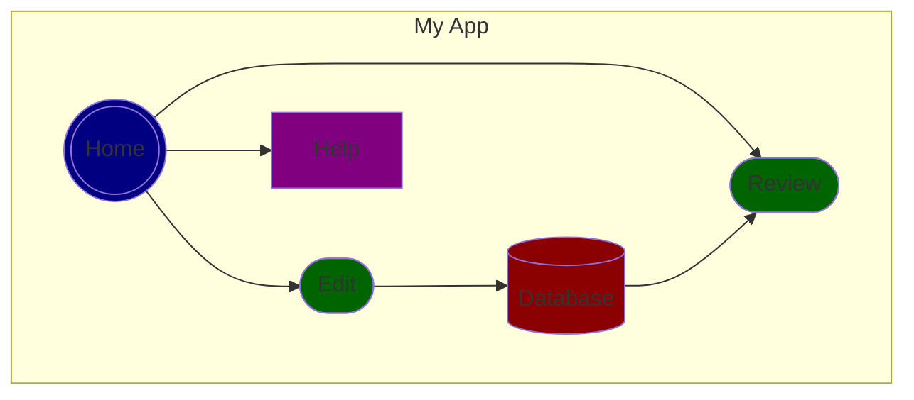
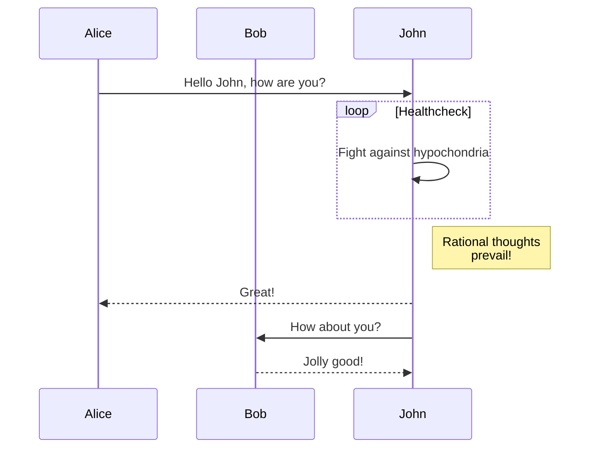
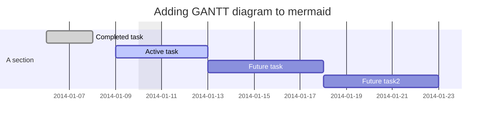
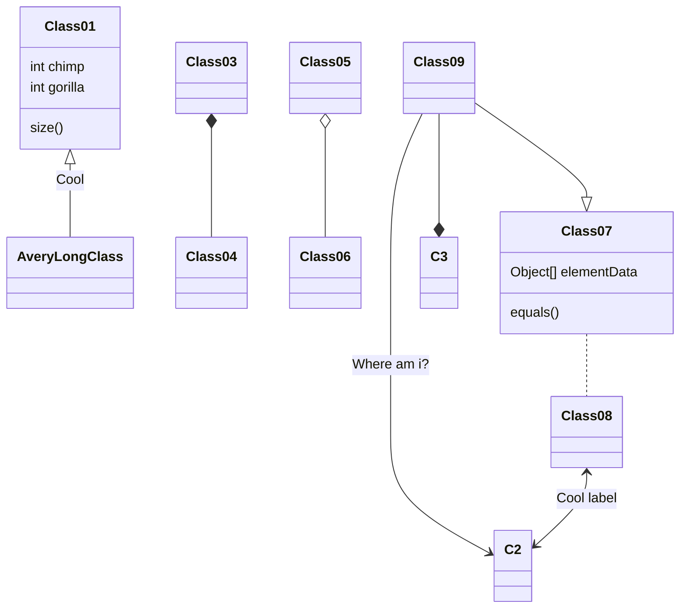
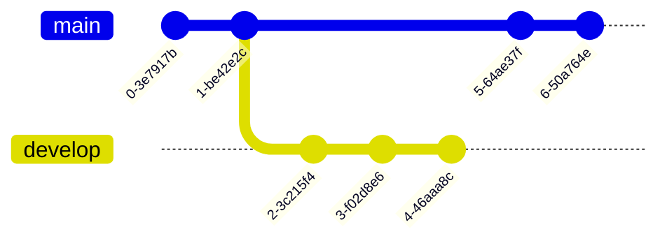
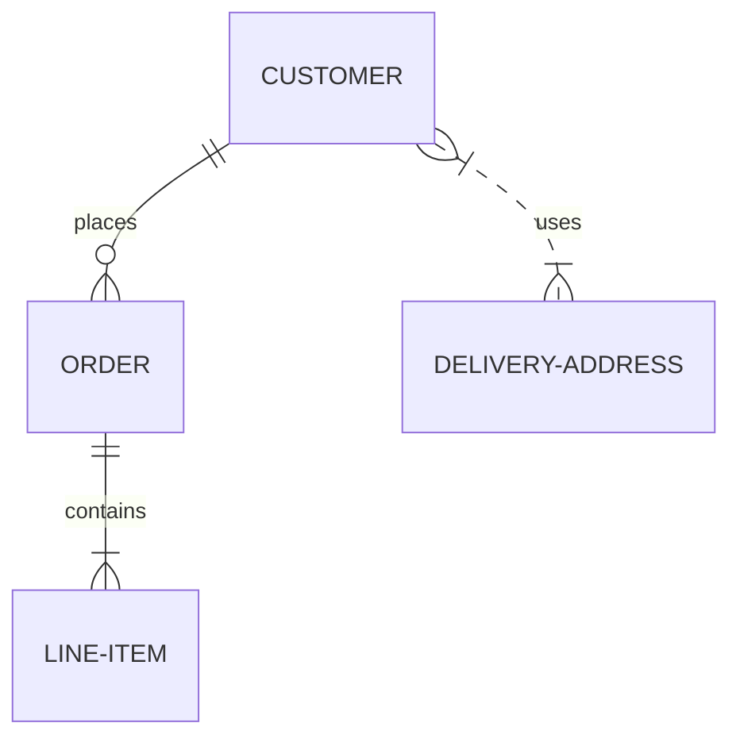
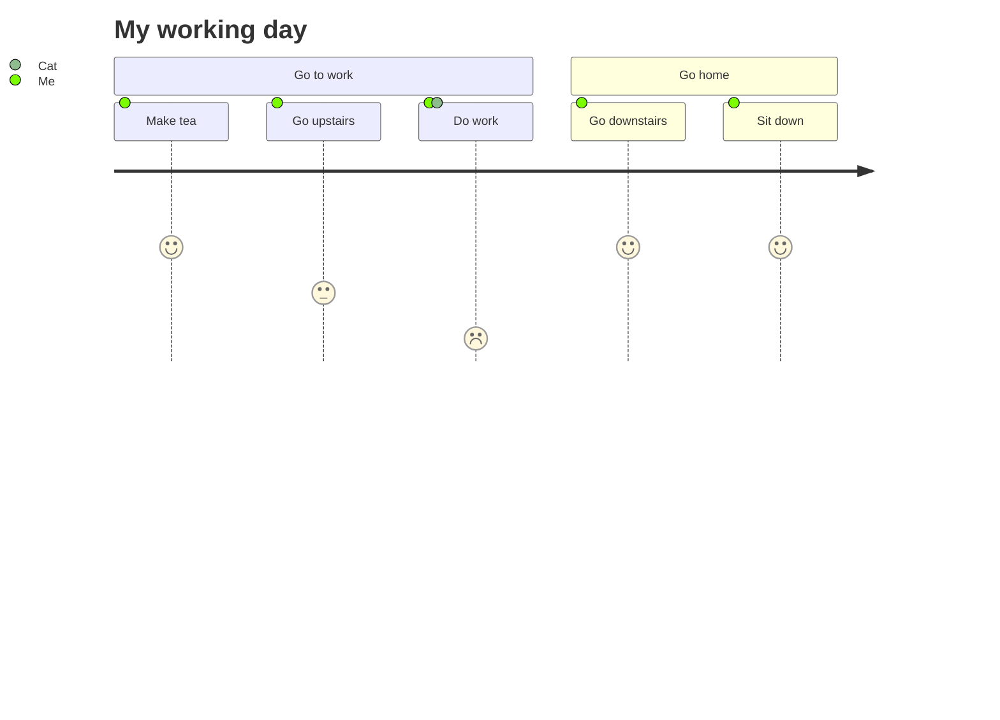
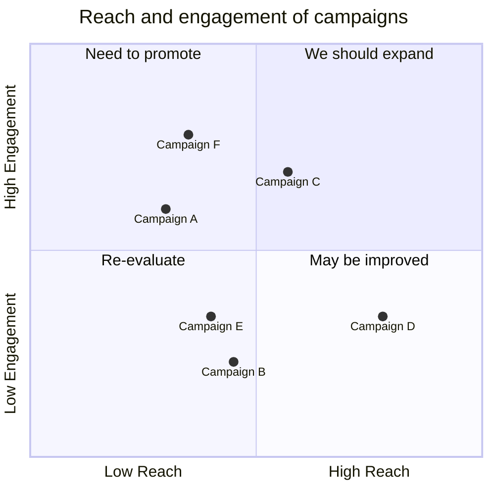

<div align="center">
    <a href="https://mermaid.js.org/" target="_blank">
        
    </a>
</div>

## Index

1. [About Mermaid](#about-mermaid)
2. [Flowchart](#flowchart)
3. [Sequence Diagram](#sequence-diagram)
4. [Gantt Diagram](#gantt-diagram)
5. [Class Diagram](#class-diagram)
6. [Git Graph](#git-graph)
7. [Entity Relationship Diagram](#entity-relationship-diagram)
8. [User Journey Diagram](#user-journey-diagram)
9. [Quadrant Chart](#quadrant-chart)

## About Mermaid

The following guide has been taken from: https://mermaid.js.org/intro/

It is not the complete guide, I have only taken the parts that I considered most important to me.

Mermaid lets you create diagrams and visualizations using text and code.

It is a JavaScript based diagramming and charting tool that renders Markdown-inspired text definitions to create and modify diagrams dynamically.

The main purpose of Mermaid is to help documentation catch up with development.

Diagramming and documentation costs precious developer time and gets outdated quickly. But not having diagrams or docs ruins productivity and hurts organizational learning.

Mermaid addresses this problem by enabling users to create easily modifiable diagrams, it can also be made part of production scripts (and other pieces of code).

Mermaid allows even non-programmers to easily create detailed and diagrams through the [Mermaid Live Editor](https://mermaid.live/).

## Flowchart

```
flowchart
    subgraph My App

    Home(((Home))); style Home fill: navy
    Review([Review]); style Review fill: darkgreen
    Edit([Edit]); style Edit fill: darkgreen
    Database[(Database)]; style Database fill: darkred
    Help[Help]; style Help fill: purple

    Home --> Review
    Home --> Edit
    Edit --> Database
    Database --> Review
    Home --> Help
end
```



## Sequence Diagram

```
sequenceDiagram
    participant Alice
    participant Bob
    Alice->>John: Hello John, how are you?
    loop Healthcheck
        John->>John: Fight against hypochondria
    end
    Note right of John: Rational thoughts <br />prevail!
    John-->>Alice: Great!
    John->>Bob: How about you?
    Bob-->>John: Jolly good!
```



## Gantt Diagram

```
gantt
dateFormat  YYYY-MM-DD
title Adding GANTT diagram to mermaid
excludes weekdays 2014-01-10

section A section
Completed task            :done,    des1, 2014-01-06,2014-01-08
Active task               :active,  des2, 2014-01-09, 3d
Future task               :         des3, after des2, 5d
Future task2               :         des4, after des3, 5d
```



## Class Diagram

```
classDiagram
Class01 <|-- AveryLongClass : Cool
Class03 *-- Class04
Class05 o-- Class06
Class07 .. Class08
Class09 --> C2 : Where am i?
Class09 --* C3
Class09 --|> Class07
Class07 : equals()
Class07 : Object[] elementData
Class01 : size()
Class01 : int chimp
Class01 : int gorilla
Class08 <--> C2: Cool label
```



## Git Graph

```
gitGraph
       commit
       commit
       branch develop
       commit
       commit
       commit
       checkout main
       commit
       commit
```



## Entity Relationship Diagram

```
erDiagram
    CUSTOMER ||--o{ ORDER : places
    ORDER ||--|{ LINE-ITEM : contains
    CUSTOMER }|..|{ DELIVERY-ADDRESS : uses
```



## User Journey Diagram

```
journey
    title My working day
    section Go to work
      Make tea: 5: Me
      Go upstairs: 3: Me
      Do work: 1: Me, Cat
    section Go home
      Go downstairs: 5: Me
      Sit down: 5: Me
```



## Quadrant Chart

```
quadrantChart
    title Reach and engagement of campaigns
    x-axis Low Reach --> High Reach
    y-axis Low Engagement --> High Engagement
    quadrant-1 We should expand
    quadrant-2 Need to promote
    quadrant-3 Re-evaluate
    quadrant-4 May be improved
    Campaign A: [0.3, 0.6]
    Campaign B: [0.45, 0.23]
    Campaign C: [0.57, 0.69]
    Campaign D: [0.78, 0.34]
    Campaign E: [0.40, 0.34]
    Campaign F: [0.35, 0.78]
```



<link rel="stylesheet" href="./../../README.css">
<a class="scrollup" href="#top">&#x1F53C</a>