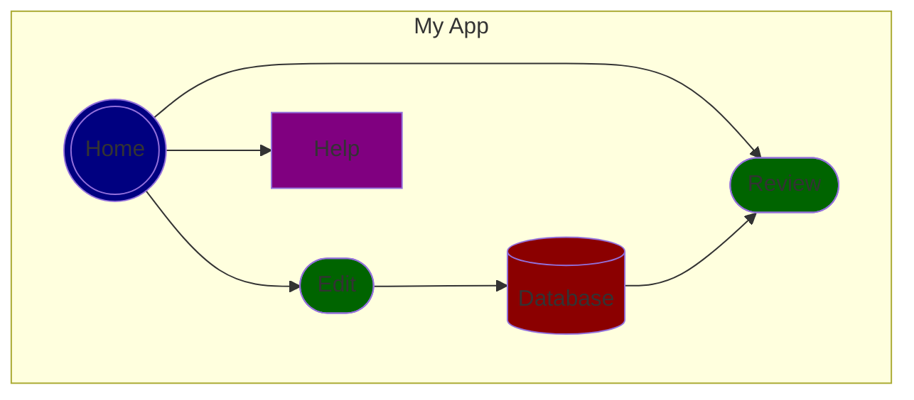

<div align="center">
    <a href="https://mermaid.js.org/">
        
    </a>
</div>

## Index

1. [Example](#example)

## Example

### Input:

    ```mermaid
    flowchart
        subgraph My App

        Home(((Home))); style Home fill: navy
        Review([Review]); style Review fill: darkgreen
        Edit([Edit]); style Edit fill: darkgreen
        Database[(Database)]; style Database fill: darkred
        Help[Help]; style Help fill: purple

        Home --> Review
        Home --> Edit
        Edit --> Database
        Database --> Review
        Home --> Help
    end
    ```

### Output:


```mermaid
flowchart
    subgraph My App

    Home(((Home))); style Home fill: navy
    Review([Review]); style Review fill: darkgreen
    Edit([Edit]); style Edit fill: darkgreen
    Database[(Database)]; style Database fill: darkred
    Help[Help]; style Help fill: purple

    Home --> Review
    Home --> Edit
    Edit --> Database
    Database --> Review
    Home --> Help
end
```