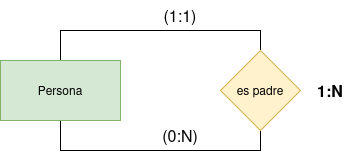
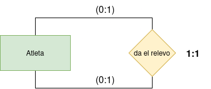
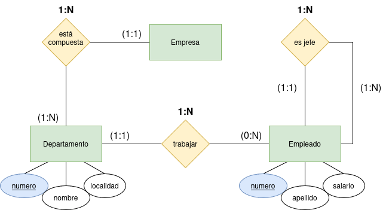

## Ejercicios básicos de E/R (Entidad/Relación)

Representa las entidades, relaciones y cardinalidades mínimas y máximas para cada uno de los siguientes supuestos:

1. En una academia los profesores dan clase a los alumnos matriculados de modo que todo profesor da clase al menos a un alumno y todo alumno recibe clase de un único profesor.
     
     
    

    
Solución

    
    

     
2. Los profesores de un centro pueden ser o no tutores de un alumno, en cualquier caso los alumnos solo podrán tener un único tutor.
     
     
    

    
Solución

    
    

     
3. En un comercio, un cliente compra varios productos, y un producto puede ser comprado por varios clientes.
     
     
    

    
Solución

    
    

     
4. Representa la relación entre personas y sus padres.
     
     
    

    
Solución

    
    

     
5. En una carrera de relevos, representa la relación dar el relevo entre atletas (para calcular las cardinalidades máxima y mínima deberás tener en cuenta si se trata de el primero, el segundo, el tercero o el último).
     
     
    

    
Solución

    
    

     
6. Una empresa está compuesta por varios departamentos de los que se desea almacenar su número, nombre y localidad. Los empleados deben estar asignados a un departamento y se guardarán sus datos número, apellido y salario. Además, cada empleado tiene un jefe. (Nota: se ha supuesto que un departamento puede no tener empleados).
     
     
    

    
Solución

    
    

     
7. Se desea construir una base de datos para mantener información sobre los equipos y partidos de la liga. Un equipo tiene un cierto número de jugadores (Id_jugador, datos_personales) y no todos participan en cada partido. Queremos registrar además por cada partido, qué jugadores juegan, la fecha y la hora del partido, resultados de los encuentros y las posiciones donde juegan.
     
     
    

    
Solución

    
    

     

<link rel="stylesheet" href="./../../../README.css">
<a class="scrollup" href="#top">&#x1F53C</a>